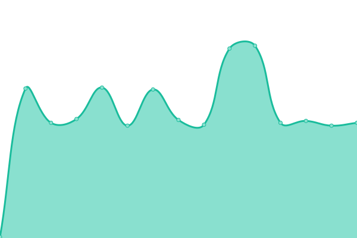
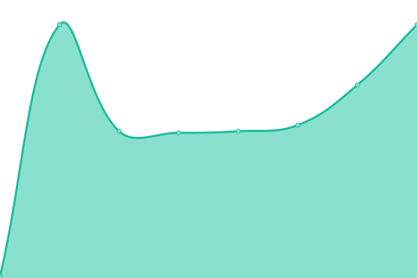
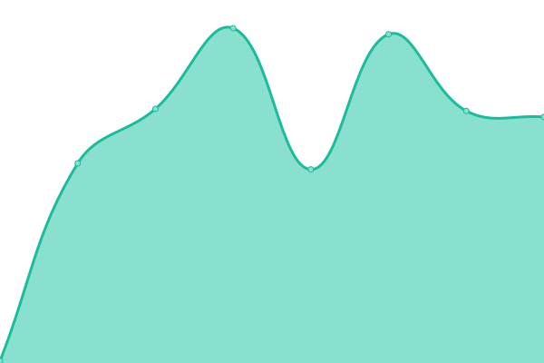
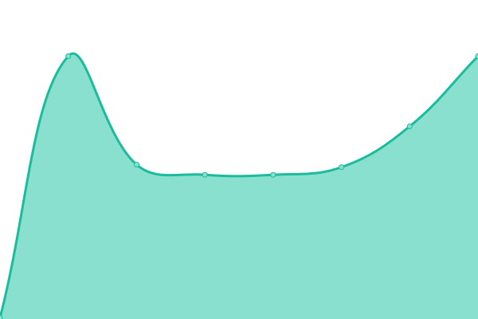
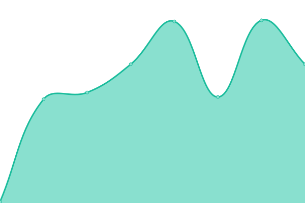
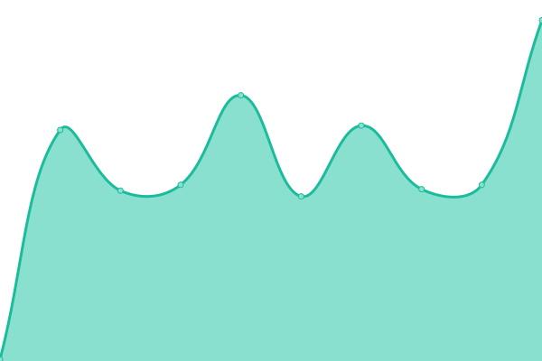
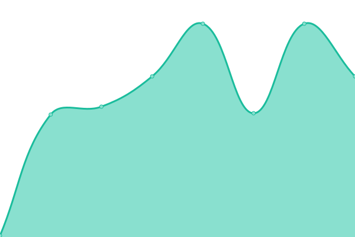
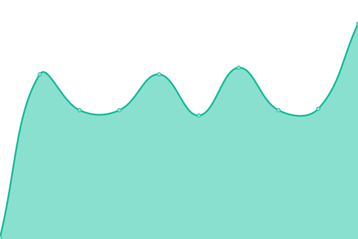
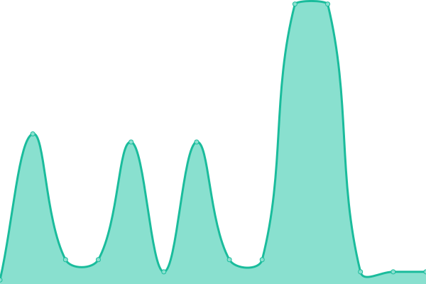
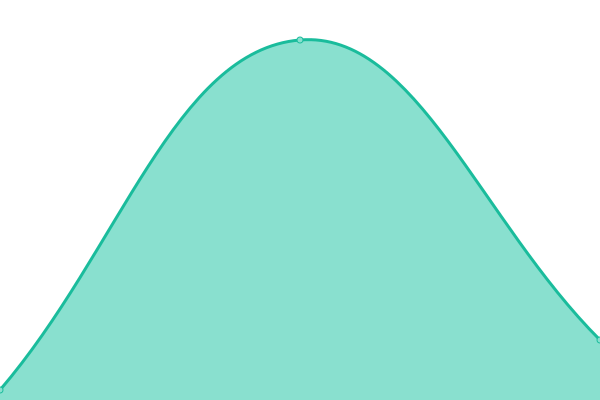

# [📈 Live Status](https://SecurosysFernandez.github.io/clouds-uptime): <!--live status--> **🟧 Partial outage**

This repository contains the open-source uptime monitor and status page for [SecurosysFernandez](https://SecurosysFernandez.github.io/clouds-uptime), powered by [Upptime](https://github.com/upptime/upptime).

With [Upptime](https://upptime.js.org), you can get your own unlimited and free uptime monitor and status page, powered entirely by a GitHub repository. We use [Issues](https://github.com/SecurosysFernandez/clouds-uptime/issues) as incident reports, [Actions](https://github.com/SecurosysFernandez/clouds-uptime/actions) as uptime monitors, and [Pages](https://SecurosysFernandez.github.io/clouds-uptime) for the status page.

<!--start: status pages-->
<!-- This summary is generated by Upptime (https://github.com/upptime/upptime) -->
<!-- Do not edit this manually, your changes will be overwritten -->
<!-- prettier-ignore -->
| URL | Status | History | Response Time | Uptime |
| --- | ------ | ------- | ------------- | ------ |
|  Securosys365 - DKE Cockpit | 🟩 Up | [securosys365-dke-cockpit.yml](https://github.com/SecurosysFernandez/clouds-uptime/commits/HEAD/history/securosys365-dke-cockpit.yml) | 

 607ms
     
 | 

<a href="https://SecurosysFernandez.github.io/clouds-uptime/history/securosys365-dke-cockpit">98.35%</a>
    

|  Double Key Encryption App | 🟩 Up | [double-key-encryption-app.yml](https://github.com/SecurosysFernandez/clouds-uptime/commits/HEAD/history/double-key-encryption-app.yml) | 

 486ms
     
 | 

<a href="https://SecurosysFernandez.github.io/clouds-uptime/history/double-key-encryption-app">100.00%</a>
    

|  Double Key Encryption Fullpath | 🟩 Up | [double-key-encryption-fullpath.yml](https://github.com/SecurosysFernandez/clouds-uptime/commits/HEAD/history/double-key-encryption-fullpath.yml) | 

 1458ms
     
 | 

<a href="https://SecurosysFernandez.github.io/clouds-uptime/history/double-key-encryption-fullpath">100.00%</a>
    

|  Transaction Security Broker - Developer | 🟥 Down | [transaction-security-broker-developer.yml](https://github.com/SecurosysFernandez/clouds-uptime/commits/HEAD/history/transaction-security-broker-developer.yml) | 

 791ms
     
 | 

<a href="https://SecurosysFernandez.github.io/clouds-uptime/history/transaction-security-broker-developer">7.17%</a>
    

|  Transaction Security Broker - Sandbox | 🟥 Down | [transaction-security-broker-sandbox.yml](https://github.com/SecurosysFernandez/clouds-uptime/commits/HEAD/history/transaction-security-broker-sandbox.yml) | 

 0ms
     
 | 

<a href="https://SecurosysFernandez.github.io/clouds-uptime/history/transaction-security-broker-sandbox">7.32%</a>
    

|  Transaction Security Broker - Economy | 🟥 Down | [transaction-security-broker-economy.yml](https://github.com/SecurosysFernandez/clouds-uptime/commits/HEAD/history/transaction-security-broker-economy.yml) | 

 0ms
     
 | 

<a href="https://SecurosysFernandez.github.io/clouds-uptime/history/transaction-security-broker-economy">7.61%</a>
    

|  Clouds DE - JCE | 🟩 Up | [clouds-de-jce.yml](https://github.com/SecurosysFernandez/clouds-uptime/commits/HEAD/history/clouds-de-jce.yml) | 

 137ms
     
 | 

<a href="https://SecurosysFernandez.github.io/clouds-uptime/history/clouds-de-jce">100.00%</a>
    

|  Clouds DE - PKCS11 | 🟩 Up | [clouds-de-pkcs-11.yml](https://github.com/SecurosysFernandez/clouds-uptime/commits/HEAD/history/clouds-de-pkcs-11.yml) | 

 110ms
     
 | 

<a href="https://SecurosysFernandez.github.io/clouds-uptime/history/clouds-de-pkcs-11">100.00%</a>
    

|  Clouds DE - CNG | 🟩 Up | [clouds-de-cng.yml](https://github.com/SecurosysFernandez/clouds-uptime/commits/HEAD/history/clouds-de-cng.yml) | 

 109ms
     
 | 

<a href="https://SecurosysFernandez.github.io/clouds-uptime/history/clouds-de-cng">100.00%</a>
    

|  Clouds CH-A - JCE | 🟩 Up | [clouds-ch-a-jce.yml](https://github.com/SecurosysFernandez/clouds-uptime/commits/HEAD/history/clouds-ch-a-jce.yml) | 

 138ms
     
 | 

<a href="https://SecurosysFernandez.github.io/clouds-uptime/history/clouds-ch-a-jce">100.00%</a>
    

|  Clouds CH-A - PKCS11 | 🟩 Up | [clouds-ch-a-pkcs-11.yml](https://github.com/SecurosysFernandez/clouds-uptime/commits/HEAD/history/clouds-ch-a-pkcs-11.yml) | 

 108ms
     
 | 

<a href="https://SecurosysFernandez.github.io/clouds-uptime/history/clouds-ch-a-pkcs-11">100.00%</a>
    

|  Clouds CH-A - CNG | 🟩 Up | [clouds-ch-a-cng.yml](https://github.com/SecurosysFernandez/clouds-uptime/commits/HEAD/history/clouds-ch-a-cng.yml) | 

 108ms
     
 | 

<a href="https://SecurosysFernandez.github.io/clouds-uptime/history/clouds-ch-a-cng">100.00%</a>
    

|  Clouds CH-B - JCE | 🟩 Up | [clouds-ch-b-jce.yml](https://github.com/SecurosysFernandez/clouds-uptime/commits/HEAD/history/clouds-ch-b-jce.yml) | 

 140ms
     
 | 

<a href="https://SecurosysFernandez.github.io/clouds-uptime/history/clouds-ch-b-jce">100.00%</a>
    

|  Clouds CH-B - PKCS11 | 🟩 Up | [clouds-ch-b-pkcs-11.yml](https://github.com/SecurosysFernandez/clouds-uptime/commits/HEAD/history/clouds-ch-b-pkcs-11.yml) | 

 108ms
     
 | 

<a href="https://SecurosysFernandez.github.io/clouds-uptime/history/clouds-ch-b-pkcs-11">100.00%</a>
    

|  Clouds CH-B - CNG | 🟩 Up | [clouds-ch-b-cng.yml](https://github.com/SecurosysFernandez/clouds-uptime/commits/HEAD/history/clouds-ch-b-cng.yml) | 

 109ms
     
 | 

<a href="https://SecurosysFernandez.github.io/clouds-uptime/history/clouds-ch-b-cng">100.00%</a>
    

|  Clouds US - JCE | 🟩 Up | [clouds-us-jce.yml](https://github.com/SecurosysFernandez/clouds-uptime/commits/HEAD/history/clouds-us-jce.yml) | 

 44ms
     
 | 

<a href="https://SecurosysFernandez.github.io/clouds-uptime/history/clouds-us-jce">100.00%</a>
    

|  Clouds US - PKCS11 | 🟩 Up | [clouds-us-pkcs-11.yml](https://github.com/SecurosysFernandez/clouds-uptime/commits/HEAD/history/clouds-us-pkcs-11.yml) | 

 18ms
     
 | 

<a href="https://SecurosysFernandez.github.io/clouds-uptime/history/clouds-us-pkcs-11">100.00%</a>
    

|  Clouds US - CNG | 🟩 Up | [clouds-us-cng.yml](https://github.com/SecurosysFernandez/clouds-uptime/commits/HEAD/history/clouds-us-cng.yml) | 

 19ms
     
 | 

<a href="https://SecurosysFernandez.github.io/clouds-uptime/history/clouds-us-cng">100.00%</a>
    

<!--end: status pages-->

[**Visit our status website →**](https://SecurosysFernandez.github.io/clouds-uptime)

## 📄 License

- Powered by: [Upptime](https://github.com/upptime/upptime)
- Code: [MIT](./LICENSE) © [SecurosysFernandez](https://SecurosysFernandez.github.io/clouds-uptime)
- Data in the `./history` directory: [Open Database License](https://opendatacommons.org/licenses/odbl/1-0/)
