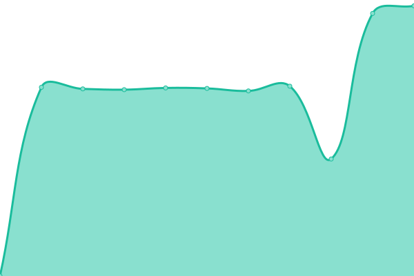

# [📈 Live Status](https://SecurosysFernandez.github.io/clouds-uptime): <!--live status--> **🟩 All systems operational**

This repository contains the open-source uptime monitor and status page for [SecurosysFernandez](https://SecurosysFernandez.github.io/clouds-uptime), powered by [Upptime](https://github.com/upptime/upptime).

With [Upptime](https://upptime.js.org), you can get your own unlimited and free uptime monitor and status page, powered entirely by a GitHub repository. We use [Issues](https://github.com/SecurosysFernandez/clouds-uptime/issues) as incident reports, [Actions](https://github.com/SecurosysFernandez/clouds-uptime/actions) as uptime monitors, and [Pages](https://SecurosysFernandez.github.io/clouds-uptime) for the status page.

<!--start: status pages-->
<!-- This summary is generated by Upptime (https://github.com/upptime/upptime) -->
<!-- Do not edit this manually, your changes will be overwritten -->
<!-- prettier-ignore -->
| URL | Status | History | Response Time | Uptime |
| --- | ------ | ------- | ------------- | ------ |
|  Securosys365 - DKE Cockpit | 🟩 Up | [securosys365-dke-cockpit.yml](https://github.com/SecurosysFernandez/clouds-uptime/commits/HEAD/history/securosys365-dke-cockpit.yml) | 

 755ms
     
 | 

<a href="https://SecurosysFernandez.github.io/clouds-uptime/history/securosys365-dke-cockpit">100.00%</a>
    

|  Double Key Encryption App | 🟩 Up | [double-key-encryption-app.yml](https://github.com/SecurosysFernandez/clouds-uptime/commits/HEAD/history/double-key-encryption-app.yml) | 

 597ms
     
 | 

<a href="https://SecurosysFernandez.github.io/clouds-uptime/history/double-key-encryption-app">100.00%</a>
    

|  Double Key Encryption Fullpath | 🟩 Up | [double-key-encryption-fullpath.yml](https://github.com/SecurosysFernandez/clouds-uptime/commits/HEAD/history/double-key-encryption-fullpath.yml) | 

 854ms
     
 | 

<a href="https://SecurosysFernandez.github.io/clouds-uptime/history/double-key-encryption-fullpath">100.00%</a>
    

|  [Transaction Security Broker - Demo](https://tsb-demo.cloudshsm.com/v1/licenseInfo) | 🟩 Up | [transaction-security-broker-demo.yml](https://github.com/SecurosysFernandez/clouds-uptime/commits/HEAD/history/transaction-security-broker-demo.yml) | 

 718ms
     
 | 

<a href="https://SecurosysFernandez.github.io/clouds-uptime/history/transaction-security-broker-demo">98.64%</a>
    

|  [Transaction Security Broker - Developer Program](https://primusdev.cloudshsm.com/v1/licenseInfo) | 🟩 Up | [transaction-security-broker-developer-program.yml](https://github.com/SecurosysFernandez/clouds-uptime/commits/HEAD/history/transaction-security-broker-developer-program.yml) | 

 1247ms
     
 | 

<a href="https://SecurosysFernandez.github.io/clouds-uptime/history/transaction-security-broker-developer-program">98.27%</a>
    

|  Transaction Security Broker - Sandbox | 🟩 Up | [transaction-security-broker-sandbox.yml](https://github.com/SecurosysFernandez/clouds-uptime/commits/HEAD/history/transaction-security-broker-sandbox.yml) | 

 857ms
     
 | 

<a href="https://SecurosysFernandez.github.io/clouds-uptime/history/transaction-security-broker-sandbox">86.82%</a>
    

|  Transaction Security Broker - Economy | 🟩 Up | [transaction-security-broker-economy.yml](https://github.com/SecurosysFernandez/clouds-uptime/commits/HEAD/history/transaction-security-broker-economy.yml) | 

 577ms
     
 | 

<a href="https://SecurosysFernandez.github.io/clouds-uptime/history/transaction-security-broker-economy">100.00%</a>
    

|  CloudsHSM - Europe (Cluster) | 🟩 Up | [clouds-hsm-europe-cluster.yml](https://github.com/SecurosysFernandez/clouds-uptime/commits/HEAD/history/clouds-hsm-europe-cluster.yml) | 

 3510ms
     
 | 

<a href="https://SecurosysFernandez.github.io/clouds-uptime/history/clouds-hsm-europe-cluster">98.88%</a>
    

|  CloudsHSM - America (Cluster) | 🟩 Up | [clouds-hsm-america-cluster.yml](https://github.com/SecurosysFernandez/clouds-uptime/commits/HEAD/history/clouds-hsm-america-cluster.yml) | 

 2217ms
     
 | 

<a href="https://SecurosysFernandez.github.io/clouds-uptime/history/clouds-hsm-america-cluster">98.89%</a>
    

|  CloudsHSM - Asia Pacific | 🟩 Up | [clouds-hsm-asia-pacific.yml](https://github.com/SecurosysFernandez/clouds-uptime/commits/HEAD/history/clouds-hsm-asia-pacific.yml) | 

 3825ms
     
 | 

<a href="https://SecurosysFernandez.github.io/clouds-uptime/history/clouds-hsm-asia-pacific">100.00%</a>
    

|  CloudsHSM - Sitzerland (Cluster) | 🟩 Up | [clouds-hsm-sitzerland-cluster.yml](https://github.com/SecurosysFernandez/clouds-uptime/commits/HEAD/history/clouds-hsm-sitzerland-cluster.yml) | 

 1442ms
     
 | 

<a href="https://SecurosysFernandez.github.io/clouds-uptime/history/clouds-hsm-sitzerland-cluster">98.88%</a>
    

<!--end: status pages-->

[**Visit our status website →**](https://SecurosysFernandez.github.io/clouds-uptime)

## 📄 License

- Powered by: [Upptime](https://github.com/upptime/upptime)
- Code: [MIT](./LICENSE) © [SecurosysFernandez](https://SecurosysFernandez.github.io/clouds-uptime)
- Data in the `./history` directory: [Open Database License](https://opendatacommons.org/licenses/odbl/1-0/)
